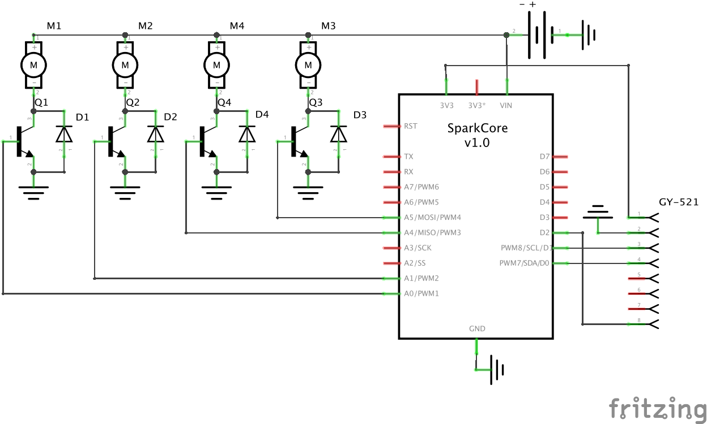

Sparkcopter Hardware
====================

Hardware design files for the Sparkcopter, a [Spark Core](http://spark.io) based quadcopter.

Contents
--------

-   [Components](#components)
    -   [Spark Core](#spark-core)
    -   [MPU-6050 Sensor](#mpu6050-sensor)
    -   [Hubsan X4 Motors](#hubsan-x4-motors)
    -   [3.7v LIPO Battery](#37v-lipo-battery)
    -   [Other Components](#other-components)
-   [Frame](#frame)
    -   [Picnic Quads Frame](#picnic-quads-frame)
    -   [Picnic Quads Motor Mounts](#picnic-quads-motor-mounts)
-   [Schematics](#schematics)
    -   [Breadboard Layout](#breadboard-layout)
    -   [Circuit Diagram](#circuit-diagram)
    -   [PCB](#pcb)

Components
----------

### Spark Core

The brains of the quadcopter, reads user input over wi-fi and sensor input from the MPU-6050, and adjusts motors accordingly. A Spark Photon should also work in place of a Spark Core.

-   [Spark Core Website](http://spark.io)
-   [Firmware Documentation](http://spark.io/firmware)

### MPU-6050 Sensor

The MPU-6050 is a 6-axis motion sensing chip, which contains both an accelerometer and a gyroscope. The GY-521 breakout board makes it easy to connect this sensor to the Spark Core.

-   [GY-521 Guide](http://playground.arduino.cc/Main/MPU-6050)
-   [MPU-6050 Specifications](http://www.invensense.com/mems/gyro/documents/PS-MPU-6000A-00v3.4.pdf)
-   [Spark Core `Wire` docs](http://docs.spark.io/firmware/#communication-wire)
-   Pinouts
    -   SDA <-> Spark Core D0
    -   SCL <-> Spark Core D1

### Hubsan X4 Motors

Small, lightweight 3.7v DC motors to provide lift and control. These motors are easy to find since they are used in the Hubsan X4 quadcopter. Inexpensive plastic propellers are available which attach directly to the motors.

-   [Buy motors on Amazon](http://www.amazon.com/Hubsan-Mini-Quadcopter-Spare-Motor/dp/B00B3RO0GE)
-   [Buy propellers on Amazon](http://www.amazon.com/gp/product/B00GZHI75C)
-   [Specifications & Performance Data](http://www.rcgroups.com/forums/showthread.php?t=2009496)
-   [Motor control guide](https://itp.nyu.edu/physcomp/labs/motors-and-transistors/using-a-transistor-to-control-high-current-loads-with-an-arduino)
-   [Spark Core `analogWrite` docs](http://docs.spark.io/firmware/#i-o-analogwrite)
-   Variants
    -   Clockwise - Red + / Blue -
    -   Counter-clockwise - White + / Black -

### 3.7v LIPO Battery

Lightweight LIPO battery to power both the Spark Core and DC motors.

-   [Buy batteries on Amazon](http://www.amazon.com/gp/product/B00HS5Y6G4/)

### Other Components

-   4 x [2N2222 Transistors](http://en.wikipedia.org/wiki/2N2222) - Used to switch low-current motor control signals from the Spark core into higher current signals suitable for driving the motors.
-   4 x [1N4004 Diodes](http://en.wikipedia.org/wiki/1N4001_and_1N5400_series_diodes) - Used as [flyback diodes](http://en.wikipedia.org/wiki/Flyback_diode) to protect the transistors from back voltage generated when the motor shuts off, or if the motor is turned in the reverse direction.

Frame
-----

### Picnic Quads Frame

Lightweight, inexpensive carbon-fiber micro quadcopter frame to mount the motors and circuit board on. The 120mm Efficiency II frame, in Carbon Fiber/Birch Core is a great fit.

- [Buy frame at Picnic Quads](http://picnicquads.com/product/efficiency-frames/)

### Picnic Quads Motor Mounts

Lightweight, inexpensive motor mounts to attach our motors securely to the frame. The 7mm standard 3d-printed mounts work great with the Efficiency II frame and our Hubson X-4 7mm motors.

- [Buy motor mounts at Picnic Quads](http://picnicquads.com/product/micro-motor-mounts/)

Schematics
----------

### Breadboard Layout

### Circuit Diagram

### PCB

